# Evidencias

Repositorio: <https://github.com/marcosdon28/IngeSoft3-2319274>

---

## TP1 — Git colaborativo

### 1. Push directo a `main` rechazado


Intento de `git push` directo sobre `main` **siendo el dueño del repositorio**. GitHub lo rechaza con
`GH006: Protected branch update failed` y `! [remote rejected] main -> main (protected branch hook
declined)`, y el comando termina con código de salida `1`. El rechazo ocurre porque la regla de
protección tiene activado *Do not allow bypassing the above settings* (`enforce_admins: true`): la
política alcanza también al administrador. Una protección que el dueño puede saltear es de adorno.

Después del intento, el commit local se deshace con `git reset --hard HEAD~1`: `main` vuelve a
`98977e4` y no queda basura en el historial.

> 📋 La imagen es la salida **real** de esa corrida sobre este repositorio, renderizada como imagen.
> El transcript literal, para que se pueda verificar carácter por carácter:
>
> ```console
> $ git push
> remote: error: GH006: Protected branch update failed for refs/heads/main.
> remote:
> remote: - Changes must be made through a pull request.
> To github.com:marcosdon28/IngeSoft3-2319274.git
>  ! [remote rejected] main -> main (protected branch hook declined)
> error: failed to push some refs to 'github.com:marcosdon28/IngeSoft3-2319274.git'
> $ echo $?
> 1
> ```

#### 1.b — La misma regla, desde el editor web de GitHub


La protección no depende del cliente que use: intentando editar el `README.md` desde la web, GitHub
avisa **«You can't commit to `main` because it is a protected branch»** y la única opción disponible
es *Create a **new branch** for this commit and start a pull request*. Es la misma política, vista
desde la otra punta — y es exactamente el empujón que describe la guía: la regla no grita, desvía.

#### 1.c — La regla, tal como quedó configurada


*Settings → Branches → regla sobre `main`*. Tres cosas para mirar:

- ✅ **Require a pull request before merging** — nada entra a `main` sin PR.
- ⬜ **Require approvals** *sin tildar* — cero aprobaciones obligatorias. Es deliberado: GitHub nunca
  permite aprobar el propio Pull Request, así que con 1 aprobación no podría mergear nunca. En un
  equipo real acá iría 1 o más.
- ✅ **Do not allow bypassing the above settings** — es la casilla que hace que la regla me alcance a
  mí, que soy el dueño. Sin ella, la evidencia 1 no habría fallado.

### 2. El PR de la rama B no se puede mergear: conflicto


Las ramas `feature/titulo-a` y `feature/titulo-b` nacieron **las dos del mismo commit de `main`** y
modificaron la **misma primera línea** del `README.md`. Con la rama A ya mergeada, el PR de la B
muestra el cartel rojo **«Merge conflicts»** y el aviso *«This branch has conflicts that must be
resolved»*, con `README.md` señalado como el archivo en conflicto. El botón *Squash and merge* queda
**deshabilitado**: no hay forma de integrar hasta decidir qué queda.

### 3. Los marcadores del conflicto


El editor de conflictos muestra las tres fronteras que Git deja en el archivo:

- `<<<<<<< feature/titulo-b (Current change)` — abre **mi** versión,
- `=======` — separa,
- `>>>>>>> main (Incoming change)` — cierra la versión que ya está en `main`.

Arriba a la derecha, *1 conflict*, y *Mark as resolved* deshabilitado: GitHub no deja avanzar
mientras quede un solo marcador en el archivo. Resolver es **decidir el contenido** —elegir una
versión, la otra o una síntesis— y borrar los marcadores; no es ejecutar un comando.

En este caso la resolución fue una **síntesis**: descarté los sufijos «versión A» y «versión B»
—que existían sólo para fabricar el conflicto— y dejé el título que el proyecto necesita de verdad,
`# Proyecto IngSoft3 — Inventario de productos (UCC 2026)`. Es el commit
[`fix: resuelve el conflicto de título del README con una síntesis`](https://github.com/marcosdon28/IngeSoft3-2319274/pull/3/commits).

### 4. La release `v1.0.0` publicada


El tag `v1.0.0` marca de forma inmutable el commit con el que cierra el TP1; la release le agrega la
comunicación de qué incluye esa versión — protecciones, los tres PRs, el conflicto resuelto y los
entregables. Versionado semántico: es la primera versión estable, así que `MAJOR.MINOR.PATCH` =
`1.0.0` (no hay compatibilidad previa que romper, ni funcionalidad agregada, ni bug corregido: es el
punto de partida).

> 📋 **Por qué la página en vivo puede mostrar otro commit.** La captura se tomó **en el momento de
> publicar la release**, con el tag donde estaba entonces. Al cerrar el práctico moví `v1.0.0` al
> commit final —para que el tag marque el estado efectivamente entregado, como pide el reglamento—,
> así que la release en vivo apunta a un commit posterior al de la imagen. El movimiento del tag
> está declarado en [`decisiones.md`](decisiones.md). La evidencia documenta **cuándo se publicó la
> release**, no en qué commit terminó el tag.

---

### Cómo se tomaron estas capturas

Las capturas del navegador (1.b, 1.c, 2, 3 y 4) se sacaron **automatizando Chrome con Playwright**
contra este mismo repositorio, con mi sesión de GitHub. Los scripts navegan a la URL, esperan a que
cargue, ubican el elemento y capturan. La 1 es la salida real de la terminal, renderizada como
imagen, con el transcript literal transcripto arriba.

---

## TP2 — Contenedores: la app del semestre

### 1. `docker compose up -d` desde cero

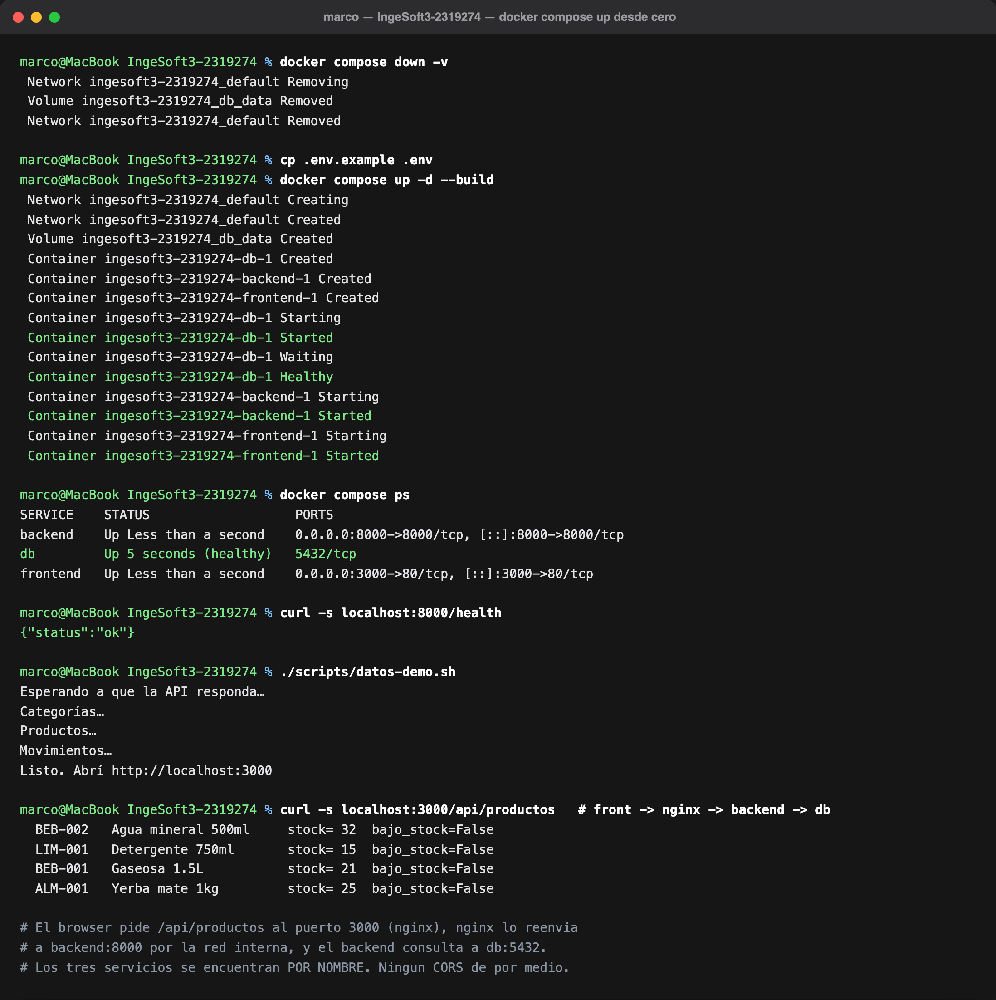

Arranque completo en una máquina limpia, empezando por `docker compose down -v` para no dejar nada
del estado anterior. Tres cosas para mirar en esa salida:

- **`db Waiting → db Healthy → backend Starting`**: eso es `depends_on` + `healthcheck` en acción.
  El backend no arranca hasta que PostgreSQL *acepta conexiones*, no apenas el contenedor existe.
- **Los puertos**: sólo `backend` y `frontend` publican puertos al host. `db` expone `5432/tcp`
  **hacia adentro de la red de compose** y no lo publica: la base no es accesible desde afuera.
- **`curl localhost:3000/api/productos` devuelve datos**: el pedido entra por nginx (puerto 3000),
  nginx lo reenvía a `backend:8000` por la red interna, y el backend consulta `db:5432`. Los tres
  servicios se encuentran **por nombre**, y como para el browser todo sale del mismo origen, no hay
  CORS de por medio.

### 2. El sistema funcionando end-to-end

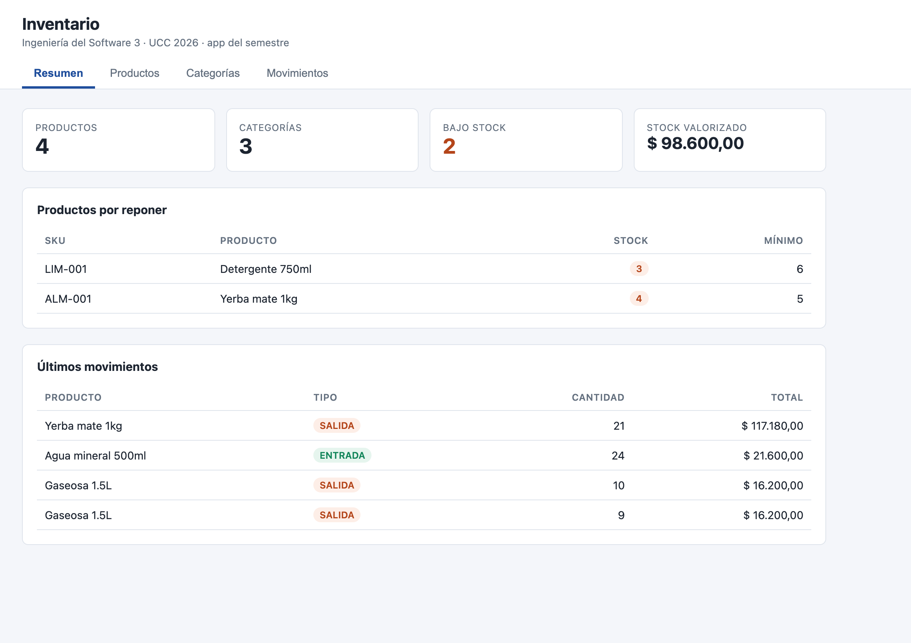

El tablero con datos reales traídos de PostgreSQL. **Bajo stock: 2** en rojo es la regla 6
funcionando: `LIM-001` tiene 3 unidades con mínimo 6, y `ALM-001` quedó en 4 con mínimo 5 después de
una salida de 21. La lista *Productos por reponer* se calcula desde el stock, no de una columna
guardada, así que no puede quedar desincronizada.

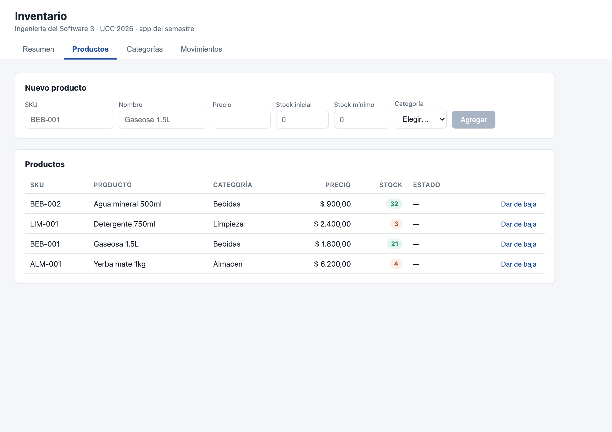

Los productos con su categoría, precio y stock. El chip del stock es verde o naranja según la regla
6. `Dar de baja` marca el producto como inactivo — y a partir de ahí la regla 7 le bloquea los
movimientos.

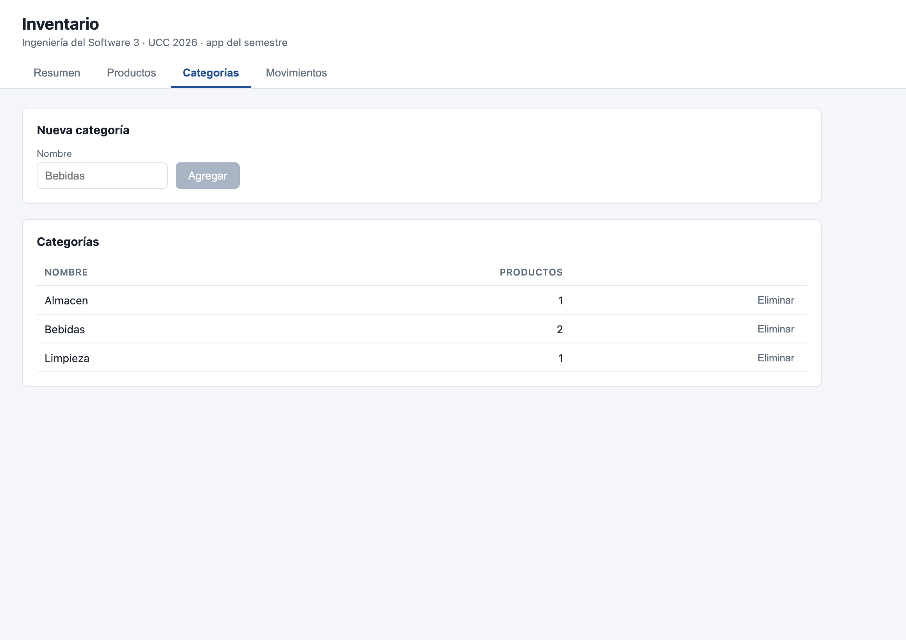

Cada categoría muestra cuántos productos tiene. **El botón *Eliminar* está deshabilitado cuando el
número es mayor a cero**: es la regla 3 reflejada en la vista. La validación de la interfaz es
comodidad, no seguridad — el backend rechaza el borrado igual, con un 400 y el motivo.

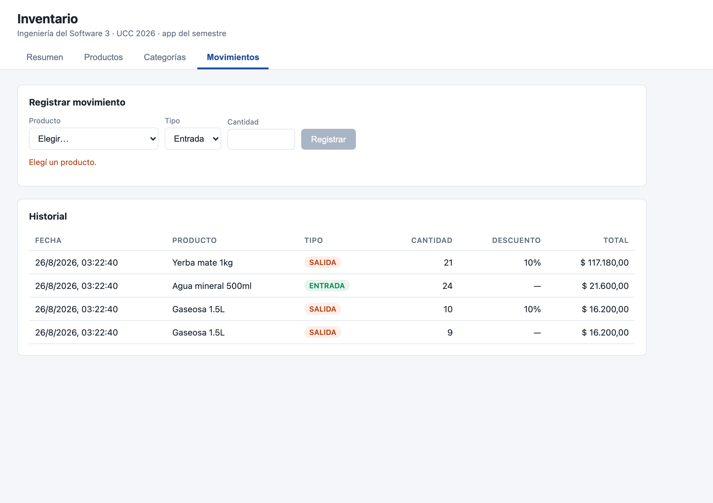

El historial con la regla 5 visible: la salida de **10 unidades tiene 10 % de descuento** y la de 9
no. Arriba, el formulario muestra *«Elegí un producto»* y el botón deshabilitado — las reglas 1, 4 y
7 evaluadas en vivo, diciendo **por qué** no se puede registrar.

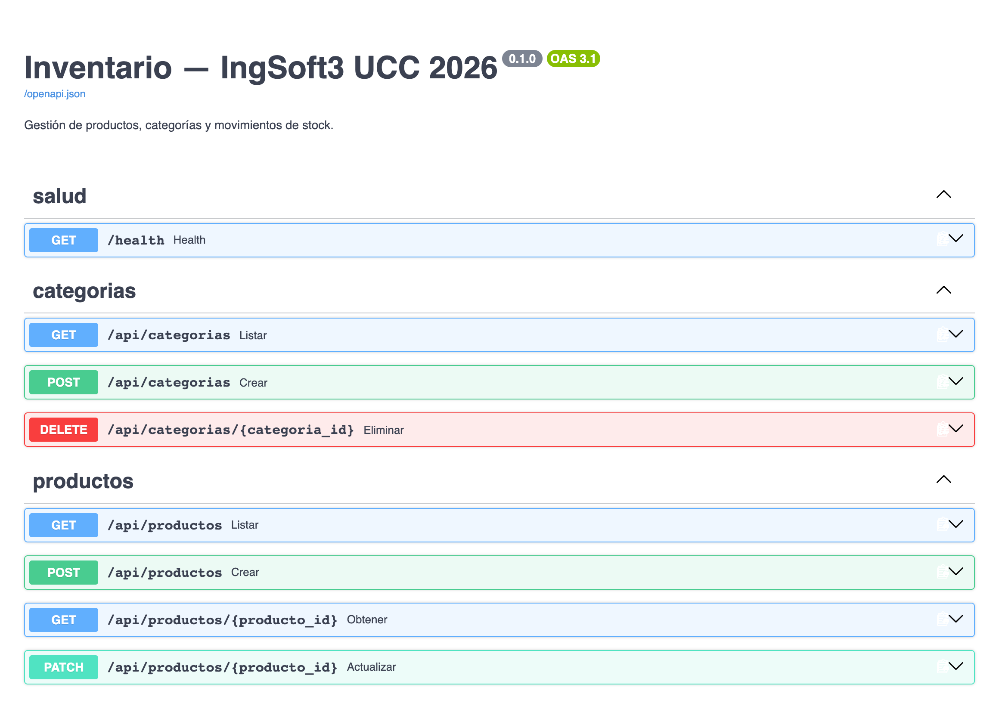

La API autodocumentada que genera FastAPI a partir de los schemas de Pydantic. No es un archivo que
haya que mantener: sale de los mismos tipos que validan la entrada.

### 3. Prueba de persistencia

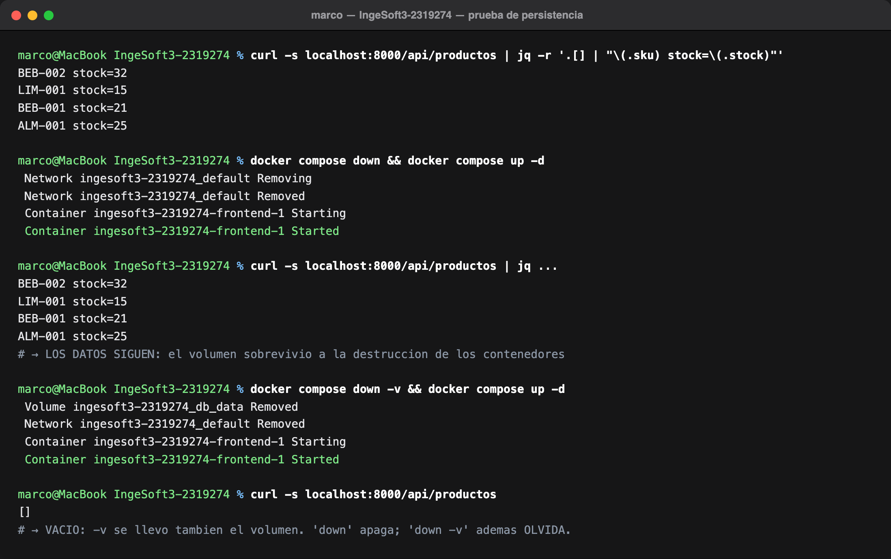

La secuencia completa, con los stocks antes y después:

1. **`docker compose down && up -d`** → los datos **siguen ahí**. Los contenedores se destruyeron y
   se volvieron a crear; el volumen `db_data` sobrevivió.
2. **`docker compose down -v && up -d`** → la lista vuelve **vacía**. El flag `-v` se llevó también
   el volumen.

`down` apaga; `down -v` además **olvida**. Es la diferencia que hace que un contenedor de base de
datos sea usable: el contenedor es descartable, el estado no.

### 4. Comparación de tamaños: multi-stage

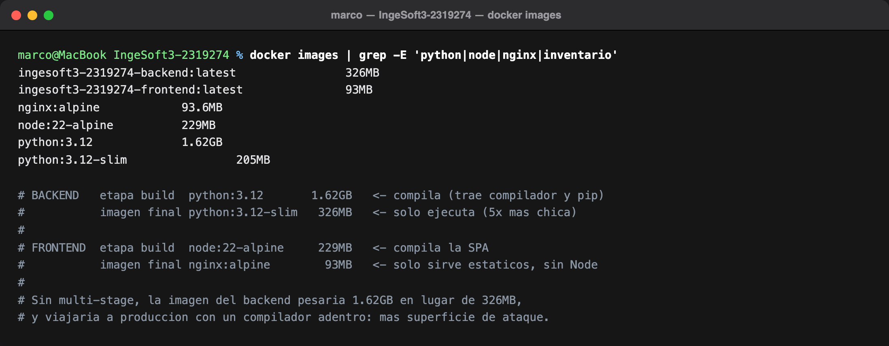

| | Imagen de build | Imagen final | Reducción |
|---|---|---|---|
| **Backend** | `python:3.12` — **1,62 GB** | `python:3.12-slim` + venv — **326 MB** | 5× |
| **Frontend** | `node:22-alpine` — 229 MB | `nginx:alpine` + estáticos — **93 MB** | 2,5× |

Sin multi-stage la imagen del backend pesaría 1,62 GB en vez de 326 MB — y viajaría a producción con
un compilador adentro, que es superficie de ataque que no hace falta. En el frontend el argumento es
todavía más claro: una SPA compilada son **archivos estáticos**, así que Node no tiene nada que hacer
en la imagen final.

### 5. Las imágenes publicadas en el registry

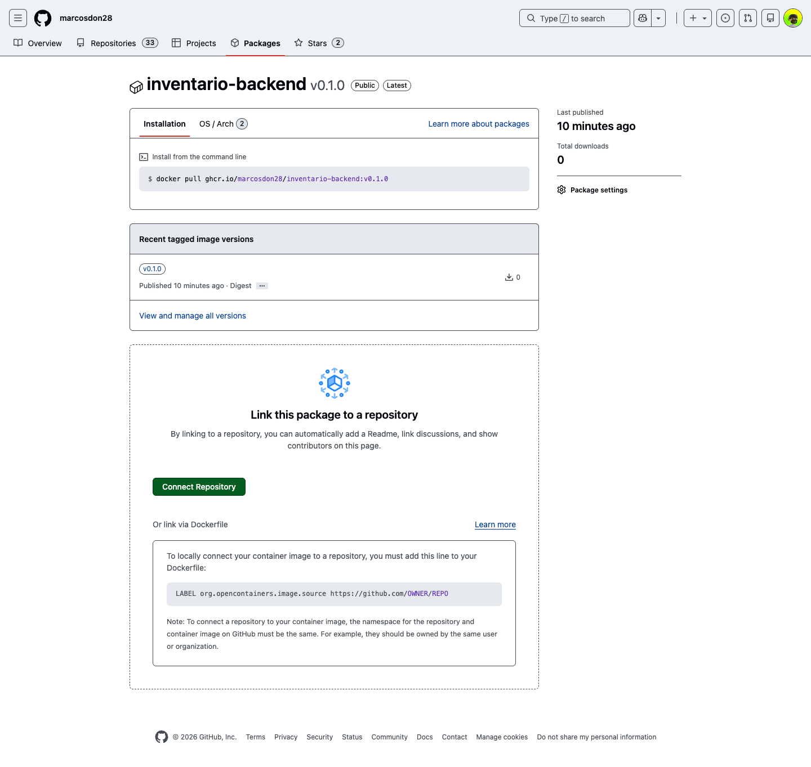

`ghcr.io/marcosdon28/inventario-backend:v0.1.0` con la etiqueta **Public** al lado del nombre y el
tag semver `v0.1.0`. La misma página muestra el comando exacto con el que cualquiera la baja. La otra
imagen, `inventario-frontend:v0.1.0`, está publicada igual.

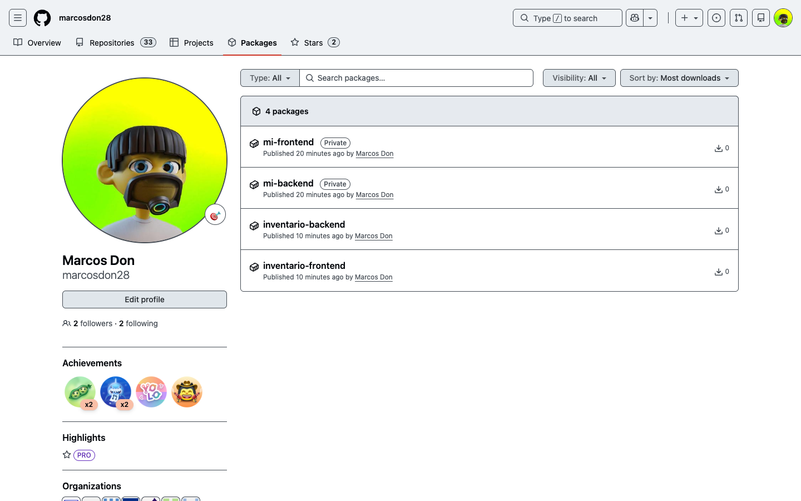

Los packages nacen **privados**: hubo que cambiarles la visibilidad a *Public* una por una. Mientras
estén privados nadie puede hacer `docker pull` — ni la cátedra, ni otra máquina, ni el pipeline del
TP7.

### 6. La prueba de verdad: bajarlas sin credenciales

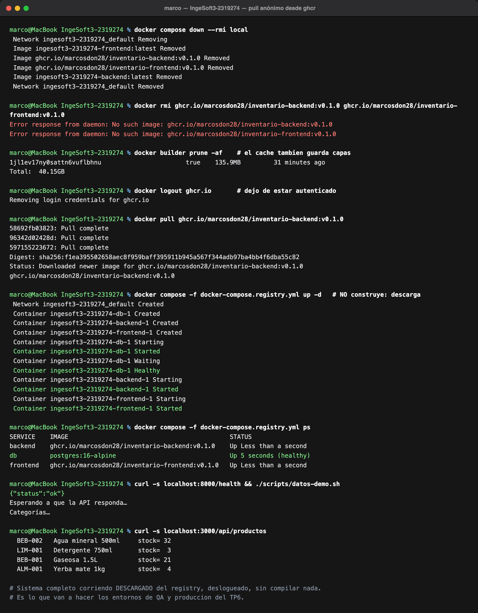

Decir que una imagen está pública es fácil; la prueba es **bajarla estando deslogueado**. La
secuencia de la captura:

1. **`docker compose down --rmi local`** — borra las imágenes que construyó compose.
2. **`docker builder prune -af`** — vacía el **cache de construcción**, que también guarda capas.
   Es el paso que nadie ve venir: sin él, el `pull` contesta `Already exists` en todo y no baja nada,
   porque Docker no guarda imágenes sino **capas identificadas por su contenido**. Acá liberó 40 GB.
3. **`docker logout ghcr.io`** — dejo de estar autenticado.
4. **`docker pull`** — baja capa por capa (`Pull complete`), sin credenciales.
5. **`docker compose -f docker-compose.registry.yml up -d`** — el sistema completo levanta
   **descargando** en vez de construir. En el `ps` se ve la diferencia: la columna *IMAGE* dice
   `ghcr.io/marcosdon28/inventario-backend:v0.1.0`, no un nombre local.

Eso es lo que van a hacer los entornos de QA y producción del TP6, y lo que va a publicar el pipeline
del TP7: el registry es el puente entre el código y los entornos.

> ⚠️ **Un detalle honesto sobre arquitecturas.** Estas imágenes se construyeron en una Mac con chip
> ARM. `docker manifest inspect` confirma que el manifiesto tiene una sola plataforma real:
> `linux/arm64` (el `unknown/unknown` que aparece al lado es el manifiesto de atestación que agrega
> BuildKit, no una arquitectura). Alguien con Intel/AMD recibiría
> `no matching manifest for linux/amd64` — y **los runners de GitHub Actions son Intel**, así que
> esto va a aparecer en el TP7. Ahí se resuelve con `docker buildx`, que construye para las dos
> arquitecturas a la vez. Para este práctico alcanza con saberlo y declararlo.
