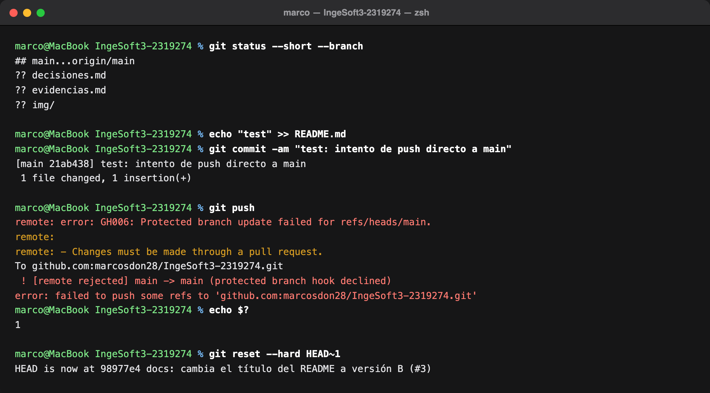
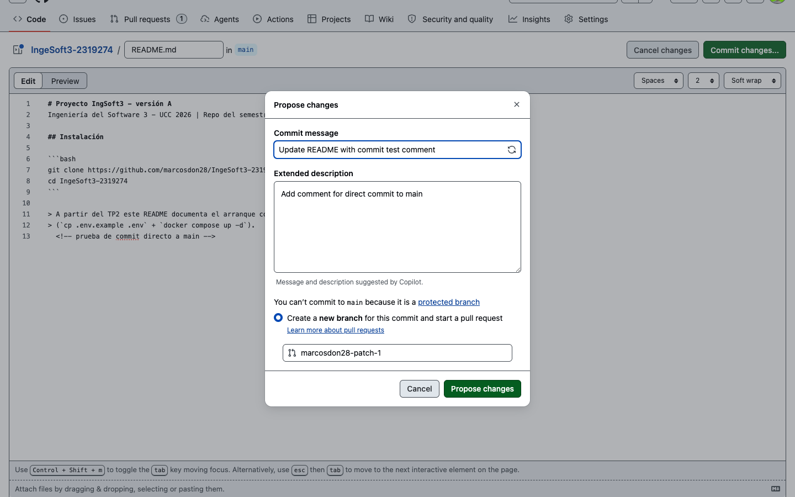
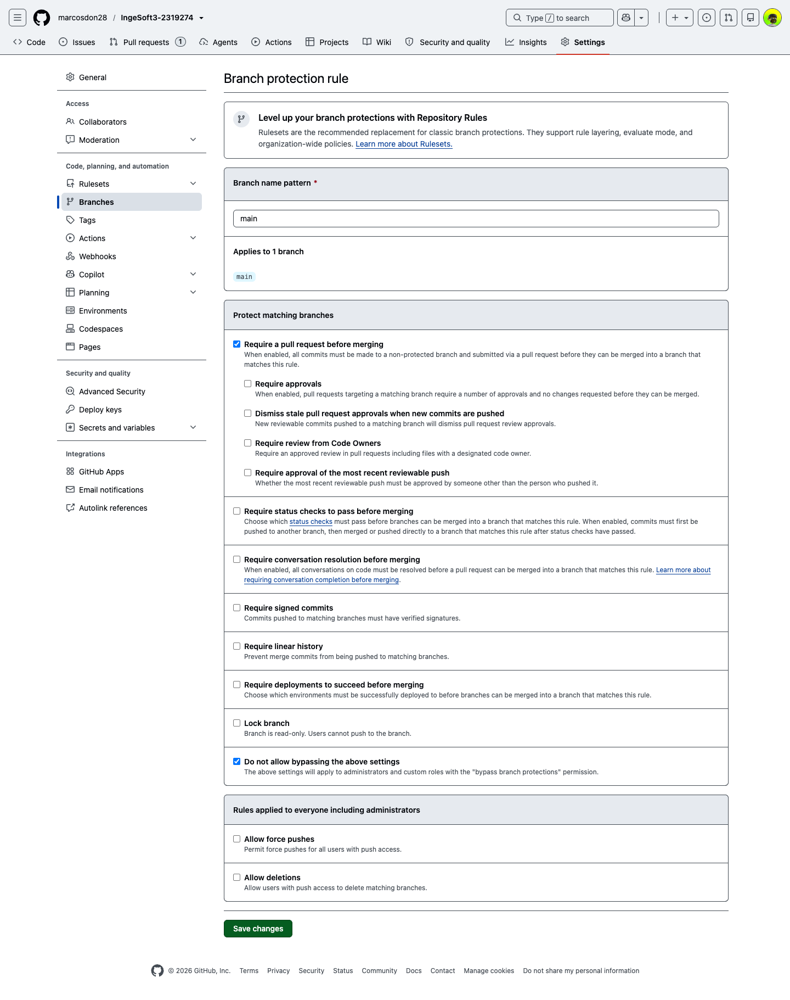
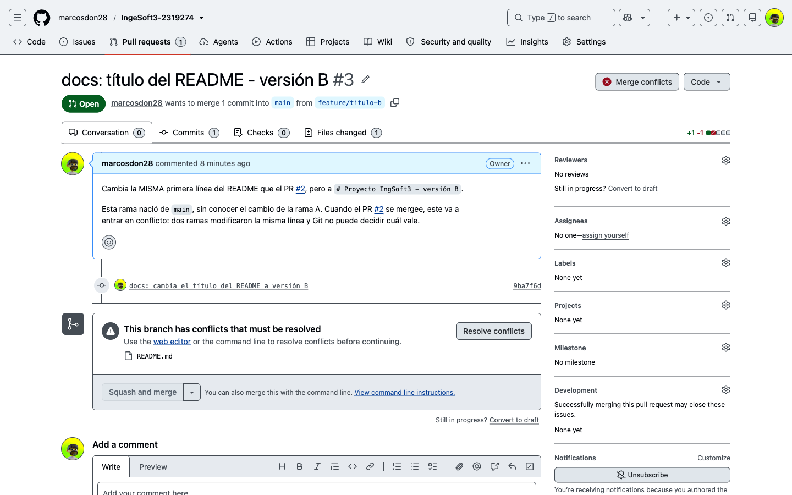
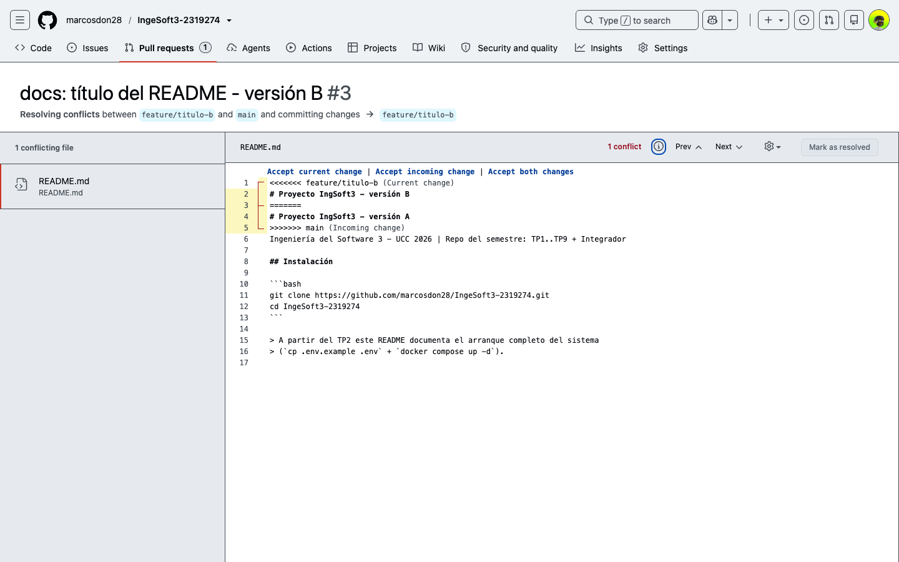
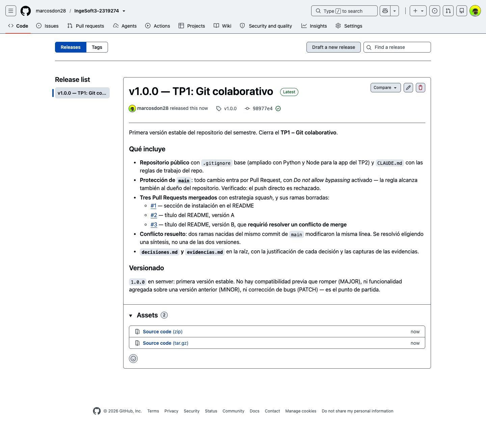

# Evidencias

Repositorio: <https://github.com/marcosdon28/IngeSoft3-2319274>

---

## TP1 — Git colaborativo

### 1. Push directo a `main` rechazado



Intento de `git push` directo sobre `main` **siendo el dueño del repositorio**. GitHub lo rechaza con
`GH006: Protected branch update failed` y `! [remote rejected] main -> main (protected branch hook
declined)`, y el comando termina con código de salida `1`. El rechazo ocurre porque la regla de
protección tiene activado *Do not allow bypassing the above settings* (`enforce_admins: true`): la
política alcanza también al administrador. Una protección que el dueño puede saltear es de adorno.

Después del intento, el commit local se deshace con `git reset --hard HEAD~1`: `main` vuelve a
`98977e4` y no queda basura en el historial.

> 📋 La imagen es la salida **real** de esa corrida sobre este repositorio, renderizada como imagen.
> El transcript literal, para que se pueda verificar carácter por carácter:
>
> ```console
> $ git push
> remote: error: GH006: Protected branch update failed for refs/heads/main.
> remote:
> remote: - Changes must be made through a pull request.
> To github.com:marcosdon28/IngeSoft3-2319274.git
>  ! [remote rejected] main -> main (protected branch hook declined)
> error: failed to push some refs to 'github.com:marcosdon28/IngeSoft3-2319274.git'
> $ echo $?
> 1
> ```

#### 1.b — La misma regla, desde el editor web de GitHub



La protección no depende del cliente que use: intentando editar el `README.md` desde la web, GitHub
avisa **«You can't commit to `main` because it is a protected branch»** y la única opción disponible
es *Create a **new branch** for this commit and start a pull request*. Es la misma política, vista
desde la otra punta — y es exactamente el empujón que describe la guía: la regla no grita, desvía.

#### 1.c — La regla, tal como quedó configurada



*Settings → Branches → regla sobre `main`*. Tres cosas para mirar:

- ✅ **Require a pull request before merging** — nada entra a `main` sin PR.
- ⬜ **Require approvals** *sin tildar* — cero aprobaciones obligatorias. Es deliberado: GitHub nunca
  permite aprobar el propio Pull Request, así que con 1 aprobación no podría mergear nunca. En un
  equipo real acá iría 1 o más.
- ✅ **Do not allow bypassing the above settings** — es la casilla que hace que la regla me alcance a
  mí, que soy el dueño. Sin ella, la evidencia 1 no habría fallado.

### 2. El PR de la rama B no se puede mergear: conflicto



Las ramas `feature/titulo-a` y `feature/titulo-b` nacieron **las dos del mismo commit de `main`** y
modificaron la **misma primera línea** del `README.md`. Con la rama A ya mergeada, el PR de la B
muestra el cartel rojo **«Merge conflicts»** y el aviso *«This branch has conflicts that must be
resolved»*, con `README.md` señalado como el archivo en conflicto. El botón *Squash and merge* queda
**deshabilitado**: no hay forma de integrar hasta decidir qué queda.

### 3. Los marcadores del conflicto



El editor de conflictos muestra las tres fronteras que Git deja en el archivo:

- `<<<<<<< feature/titulo-b (Current change)` — abre **mi** versión,
- `=======` — separa,
- `>>>>>>> main (Incoming change)` — cierra la versión que ya está en `main`.

Arriba a la derecha, *1 conflict*, y *Mark as resolved* deshabilitado: GitHub no deja avanzar
mientras quede un solo marcador en el archivo. Resolver es **decidir el contenido** —elegir una
versión, la otra o una síntesis— y borrar los marcadores; no es ejecutar un comando.

En este caso la resolución fue una **síntesis**: descarté los sufijos «versión A» y «versión B»
—que existían sólo para fabricar el conflicto— y dejé el título que el proyecto necesita de verdad,
`# Proyecto IngSoft3 — Inventario de productos (UCC 2026)`. Es el commit
[`fix: resuelve el conflicto de título del README con una síntesis`](https://github.com/marcosdon28/IngeSoft3-2319274/pull/3/commits).

### 4. La release `v1.0.0` publicada



El tag `v1.0.0` marca de forma inmutable el commit con el que cierra el TP1; la release le agrega la
comunicación de qué incluye esa versión — protecciones, los tres PRs, el conflicto resuelto y los
entregables. Versionado semántico: es la primera versión estable, así que `MAJOR.MINOR.PATCH` =
`1.0.0` (no hay compatibilidad previa que romper, ni funcionalidad agregada, ni bug corregido: es el
punto de partida).

> 📋 **Por qué la página en vivo puede mostrar otro commit.** La captura se tomó **en el momento de
> publicar la release**, con el tag donde estaba entonces. Al cerrar el práctico moví `v1.0.0` al
> commit final —para que el tag marque el estado efectivamente entregado, como pide el reglamento—,
> así que la release en vivo apunta a un commit posterior al de la imagen. El movimiento del tag
> está declarado en [`decisiones.md`](decisiones.md). La evidencia documenta **cuándo se publicó la
> release**, no en qué commit terminó el tag.

---

### Cómo se tomaron estas capturas

Las capturas del navegador (1.b, 1.c, 2, 3 y 4) se sacaron **automatizando Chrome con Playwright**
contra este mismo repositorio, con mi sesión de GitHub. Los scripts navegan a la URL, esperan a que
cargue, ubican el elemento y capturan. La 1 es la salida real de la terminal, renderizada como
imagen, con el transcript literal transcripto arriba.
